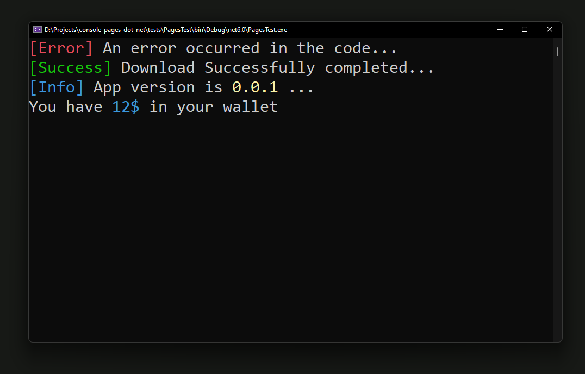

# console-pages-dot-net
a lite weight library for create daynamic console applications in dotnet

new syntax :
```csharp
using ConsolePages;

CApp cApp = new CApp();

cApp.ShowPage(new Page(cApp.Layout, (a) =>
{
    a.Print(("[Error]", a.ErrorColor), ("An error occurred in the code...", a.PrimeColor));
    a.Print(("[Success]", a.SuccessColor), ("Download Successfully completed...", a.PrimeColor));
    a.Print(("[Info]", a.InfoColor), ("App version is 0.0.1 ...", a.PrimeColor));
    a.Print(("You have", a.PrimeColor), ("12$", a.InfoColor), ("in your wallet",a.PrimeColor));
}));
```

old syntax (in dotnet) : 

```csharp
Console.ForegroundColor = ConsoleColor.Red;
Console.Write("[Error]");
Console.ResetColor();
Console.WriteLine(" An error occurred in the code...");

Console.ForegroundColor = ConsoleColor.Green;
Console.Write("[Success]");
Console.ResetColor();
Console.WriteLine(" Download Successfully completed...");

Console.ForegroundColor = ConsoleColor.Cyan;
Console.Write("[Info]");
Console.ResetColor();
Console.WriteLine(" App version is 0.0.1 ...");

Console.ResetColor();
Console.WriteLine("You have");
Console.ForegroundColor = ConsoleColor.Cyan;
Console.Write(" 12$ ");
Console.ResetColor();
Console.WriteLine("in your wallet");
```

for this result : 

